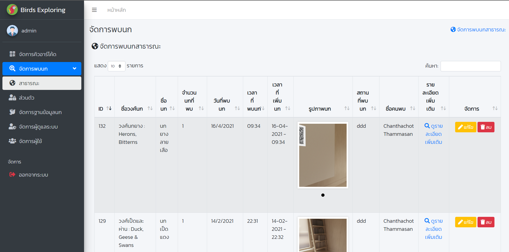
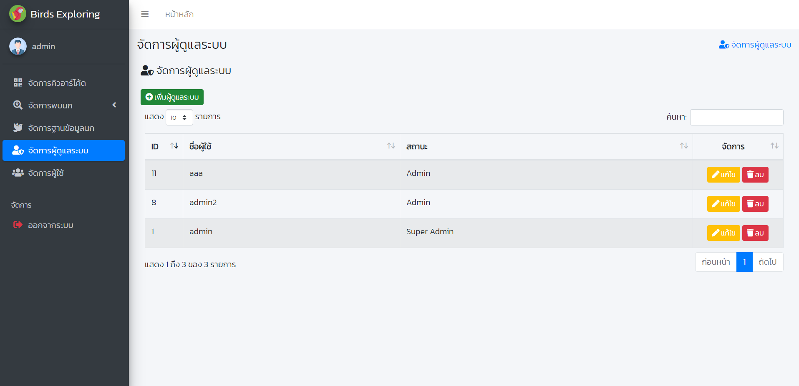

# ระบบสำรวจนก Birds Exploring

### ระบบจัดการหลังบ้านสำหรับแอปพลิเคชันสำรวจนก Birds Exploring

#### Tools

- PHP
- MySQL
- JavaScript

#### Installation

1. Dump Database **bird.sql** และ **qrcode.sql** ในโฟลเดอร์ **database** ลงใน PHPMyadmin
2. นำโฟลเดอร์ **birds-exploring-backend** ไปไว้บน Server

#### หน้าจอการทำงานของเว็บไซต์

> หน้าเข้าสู่ระบบ

  

> หน้าแรก

  

> หน้าแรก

  

> หน้าแรก

  

> หน้าแรก

  

> หน้าแรก

  

> หน้าแรก

  

> หน้าแรก

  

> หน้าแรก

  

> หน้าแรก

  

> หน้าแรก

  

> หน้าแรก

  

> หน้าแรก

  

> หน้าแรก

  

> หน้าแรก

  

> หน้าแรก

  

> หน้าแรก

500
  

> หน้าแรก

  

> หน้าแรก

  

> หน้าแรก

  

> หน้าแรก

  

> หน้าแรก

  

> หน้าแรก

  

> หน้าแรก

  

> หน้าแรก

  

> หน้าแรก

  

> หน้าแรก

  

> หน้าแรก

  

> หน้าแรก

  

> หน้าแรก

  

---

### แอปพลิเคชันสำรวจนก Birds Exploring

#### Tools

- Kotlin
- MySQL
- Firebase
- Node.js

#### Installation

1. Dump Database **bird.sql** และ **qrcode.sql** ในโฟลเดอร์ **database** ลงใน PHPMyadmin
2. นำโฟลเดอร์ **birds-exploring-backend** ไปไว้บน Server
3. ใช้ Android Studio เปิดโฟลเดอร์ **birds-exploring-app** และรันลง Emulator
4. ใช้ Node ในการเปิด API ในโฟลเดอร์ **BirdAPI**

#### หน้าจอการทำงานของแอปพลิเคชัน

> หน้าแรก

  

> หน้าแรก

  

> หน้าแรก

  

> หน้าแรก

  

> หน้าแรก

  

> หน้าแรก

  

> หน้าแรก

  

> หน้าแรก

  

> หน้าแรก

  

> หน้าแรก

  

> หน้าแรก

  

> หน้าแรก

  

> หน้าแรก

  

> หน้าแรก

  

> หน้าแรก

  

> หน้าแรก

  

> หน้าแรก

  

> หน้าแรก

  

> หน้าแรก

  

> หน้าแรก

  

> หน้าแรก

  

> หน้าแรก

  

> หน้าแรก

  

> หน้าแรก

  

> หน้าแรก

  

> หน้าแรก

  

> หน้าแรก

  

> หน้าแรก

  

> หน้าแรก

  

> หน้าแรก

  

> หน้าแรก

  

> หน้าแรก

  

